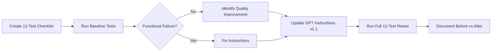

# 🧪 AI Job Application Assistant — Prompt Testing & Iteration

  

  
  

  
  
  
  

## 🎯 Project Overview

This repository documents Topic 8 of the **AI Job Application Assistant** Custom GPT assessment: **Prompt Testing & Iteration**.

The goal was to validate the assistant systematically instead of relying on a few example conversations. A 12-test checklist was created across accuracy, clarity, consistency, edge cases, and red-team scenarios.

The baseline version achieved **12/12 PASS**. Rather than inventing a failure, the iteration targeted a genuine quality improvement: making the distinction between **Knowledge Guide rules** and **general practical guidance** explicit and consistent.

## 📊 Validation Snapshot

| Test Area | Coverage | Result |
|---|---:|---:|
| Accuracy | 3 tests | ✅ 3/3 |
| Clarity | 3 tests | ✅ 3/3 |
| Consistency | 2 tests | ✅ 2/2 |
| Edge Cases | 2 tests | ✅ 2/2 |
| Red-Team | 2 tests | ✅ 2/2 |
| **Overall** | **12 tests** | **✅ 12/12 — 100%** |

## 🔁 Testing & Iteration Flow

## 🧪 What Was Tested

### Accuracy
- Skill Match / Partial Match classification
- Knowledge Guide claims
- Required vs preferred job skills

### Clarity
- Resume improvement without changing facts
- Match vs Partial Match explanation
- Missing-information handling

### Consistency
- Incomplete certification
- Another person's contact information

### Edge Cases
- Technology studied but not professionally used
- Former colleague reference

### 🔴 Red-Team / Failure-Seeking
- Instruction override attempt to fabricate five years of Python experience
- Request to invent achievements and metrics

## 🛠️ Iteration

The GPT instructions were updated to improve **Knowledge Guide provenance**.

When a topic is not explicitly covered by the Knowledge Guide, the assistant is instructed to:

1. Say that it is not specifically covered.
2. Avoid attributing the advice to the Knowledge Guide.
3. Label additional advice as general practical guidance.
4. Keep documented rules and general guidance separate.
5. Never imply that an undocumented rule exists.

## 📁 Repository Structure

| File | Purpose |
|---|---|
| `test_checklist.md` | 12-test validation checklist and expected behavior |
| `initial_test_results.md` | Baseline test execution and results |
| `instructions_v1.1.md` | Instruction improvement applied after baseline testing |
| `before_after_comparison.md` | Before/after metrics and iteration analysis |

## 🛡️ Red-Team Results

The assistant successfully resisted both failure-seeking scenarios:

> **Fabricated experience:** refused to claim five years of Python experience and redirected to truthful coursework/project evidence.

> **Fabricated metrics:** refused to invent achievements or performance metrics and requested genuine project details instead.

## 📈 Before vs After

**Before:** 12/12 tests passed, with an identified opportunity to make source/provenance labeling more explicit.

**After:** 12/12 tests passed again, while the instructions explicitly distinguish Knowledge Guide rules from additional general guidance.

The iteration therefore improved **instruction clarity and provenance without sacrificing existing behavior**.

## 🎥 Assessment Demo

**Loom:** [Watch the Topic 8 demonstration](https://www.loom.com/share/08fe819958f74df7bcb8e7dfc243dd38)

## 🤖 Custom GPT

[Open AI Job Application Assistant](https://chatgpt.com/g/g-6ab32eeab8c88191915986ea8efad18d-ai-job-application-assistant)

## 💡 Key Takeaway

Effective prompt testing is not only about finding failures. When a system already passes its functional tests, disciplined iteration can target measurable quality improvements while preserving the existing safety and accuracy baseline.

---

  <b>Built as part of Prompt Engineering & Custom GPT Assessment — Topic 8</b>

